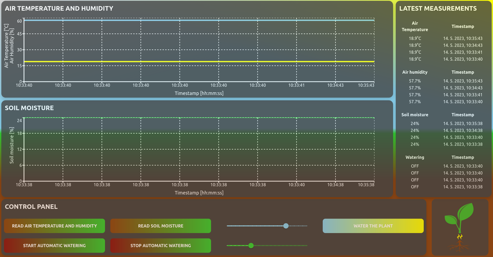

# Automatic-virtual-meassurement-systems

<div style="display: flex; justify-content: center;">
  
</div>

This is a custom solution for monitoring plant growth using an analog soil moisture sensor, DHT22 air temperature and humidity sensor, and a relay module for controlling the water pump. The system is designed to run on a Raspberry Pi, with a Python asyncio API, and is deployed using Docker. The Raspberry Pi is connected to the server via Tailscale Zero Tier VPN, and on the server side, there is a middleware Golang API that forwards all data to a PostgreSQL database. Additionally, there is a NextJS frontend server written in React and Typescript that serves a real-time website of the sensors that are connected to the Raspberry Pi.

Both the RPi API and Server are forwarded through nginx reverse proxy for aditional customization and security.

## Getting Started

### Hardware prerequsites
- RaspberryPi 3/4 (These were tested and work, should also work for others by editing the .env files in `/Raspberry-pi` folder)
- Analog soil moisture sensor (Tested with the simple capacitive one that is readily available)
- DHT22 sensor
- Relay module to work with RPi
- Analog-digital-converter MCP3008 for the soil moisture sensor (or any equivalent that is compatible with *CircuitPython* library)
- Breakout board (With correct pinout to the sensors and ADC)

### Software prerequisites
- Docker and Docker compose
- Tailscale VPN (or any other viable VPN that connects RPI with the server)
- Optional software for non-containerized development:
  - Next.js 
  - PostgreSQL
  - Nginx

### Installing
1. Clone this repository:
  ```bash
    git clone https://github.com/Timotej979/Automatic-virtual-meassurement-systems.git 
    cd Automatic-virtual-meassurement-systems
  ```
2. Set up Tailscale and make sure the Raspberry Pi and Server are connected to the same Tailscale network.

3. Build and run the Docker containers in respective folders (`/Raspberry-pi` and `/Server`):
  ```bash
    docker compose build 
    docker-compose up
  ```
4. Navigate to the frontend website that is proxied through nginx: http://localhost:5001/dashboard

<div style="display: flex; justify-content: center;">
  
</div>

## Usage

Once the system is set up and running, the sensors connected to the Raspberry Pi will begin sending data to the Python asyncio API, which will forward the data to the middleware Golang API on the server. The middleware API will then store the data in the PostgreSQL database. The frontend website will display the real-time data from the sensors, allowing you to monitor the plant growth and control the water pump using the relay module.
## Contributing

Contributions are welcome! To contribute to this project, fork this repository and make your changes. Once you're ready to submit your changes, create a pull request.

## License

This project is licensed under the BSD-3-Clause License. See the LICENSE file for details.